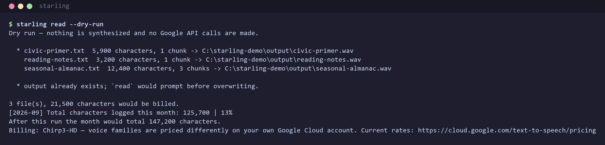

# Starling

[](https://github.com/TheGeneCode/Starling/releases)
[](https://github.com/TheGeneCode/Starling/actions/workflows/ci.yml)
[](LICENSE)

Read saved articles aloud. Starling turns `.txt` articles into narrated `.wav` files using Google Cloud Text-to-Speech, so a backlog of long reads becomes something you can listen to on a walk.



> Starling is a personal-use command-line tool. It calls **your own** Google Cloud account and **you are billed for what you synthesize** — read [What It Costs](#what-it-costs) before your first run. Not affiliated with Google.

💛 [Sponsor this project](https://github.com/sponsors/TheGeneCode)

---

## Table of Contents

- [What Starling Does](#what-starling-does)
- [Requirements](#requirements)
- [Installation](#installation)
- [Set Up Google Cloud Credentials](#set-up-google-cloud-credentials)
- [What It Costs](#what-it-costs)
- [Choosing a Voice](#choosing-a-voice)
- [How to Use](#how-to-use)
- [Command Reference](#command-reference)
- [Configuration Reference](#configuration-reference)
- [Updates](#updates)
- [Troubleshooting](#troubleshooting)
- [Developer Setup](#developer-setup)
- [License](#license)

---

## What Starling Does

Starling reads plain-text articles you have saved and narrates them into `.wav` files with Google Cloud's neural voices, one file per article, archiving each input once it is done. It is for people who collect more long-form reading than they get through and would rather listen to it — and who are willing to run their own Google Cloud project to get voices better than a phone's built-in reader.

**Features at a glance**

| Feature | What it does |
|---|---|
| **Clipboard-capture window** | `starling capture` watches your clipboard and saves copied article text and title straight into the input directory |
| **Random voice per article** | Picks a different voice from a pool for each article by default, so a batch doesn't sound identical file after file |
| **Free voice validation** | Every configured voice name is checked against Google's live catalog before anything is billed |
| **`--dry-run` cost preview** | Reports exactly what a run would synthesize and bill, with no API calls and no credentials needed |
| **Usage log with running total** | Every synthesis appends a line with the character count and the month's running total |
| **Automatic chunking** | Long articles are split at sentence boundaries to stay under Google's per-request byte limit |
| **Archiving** | A successfully synthesized input moves to the archive directory, so a batch is safe to re-run |

---

## Requirements

- Python **3.12 or newer** (`requires-python = ">=3.12"` in `pyproject.toml`).
- **[uv](https://docs.astral.sh/uv/getting-started/installation/)**.
- A **Google Cloud account with billing enabled** — required even to stay inside the free tier. See [Set Up Google Cloud Credentials](#set-up-google-cloud-credentials).
- `starling capture` additionally needs **tkinter** and a graphical desktop. It is Windows-tested; `read`, `voices` and `usage` are cross-platform.

---

## Installation

> **Do not run** `uv tool install` naming the bare `starling` package. The name `starling` on PyPI belongs to an unrelated project. Starling is not published to PyPI — it is installed from its git repository or from a release wheel. (`docs/RELEASING.md` explains why: a direct-reference dependency makes the distribution ineligible for PyPI upload.)

Starling isn't on PyPI, so `uv tool install` needs an exact git tag rather than a bare package name. Check the [Releases page](https://github.com/TheGeneCode/Starling/releases) for the current tag and substitute it for `vX.Y.Z` below:

```
uv tool install "starling @ git+https://github.com/TheGeneCode/Starling@vX.Y.Z"
starling --version
```

Pinning the tag is deliberate, not an oversight — it means installing never silently picks up an unreviewed commit. Upgrading means re-running the same command with a newer tag and `--force`; see [Updates](#updates).

Two alternatives:

- **Try it without installing:**
  `uvx --from "git+https://github.com/TheGeneCode/Starling@vX.Y.Z" starling --help`
- **From a release wheel:** download `starling-X.Y.Z-py3-none-any.whl` from the [Releases page](https://github.com/TheGeneCode/Starling/releases), then
  `uv tool install ./starling-X.Y.Z-py3-none-any.whl`.

If `starling` is not found after installing, `uv tool update-shell` puts uv's tool directory on `PATH` (a new shell is needed afterwards).

---

## Set Up Google Cloud Credentials

### Create a Google Cloud Project

1. Go to [Google Cloud Console](https://console.cloud.google.com/)
2. Click the **Project** dropdown at the top
3. Click **NEW PROJECT**
4. Enter a project name (e.g., "starling-tts")
5. Click **CREATE**
6. Wait for the project to be created, then select it from the dropdown

### Enable the Text-to-Speech API

1. In the Cloud Console, go to **APIs & Services** > **Library**
2. Search for "Text-to-Speech"
3. Click on **Cloud Text-to-Speech API**
4. Click **ENABLE**

### Create a Service Account

1. Go to **APIs & Services** > **Credentials**
2. Click **+ CREATE CREDENTIALS** > **Service Account**
3. Fill in the details:
   - Service account name: `starling-service-account` (or any name)
   - Service account ID: auto-fills
   - Description: `Service account for article TTS conversion`
4. Click **CREATE AND CONTINUE**
5. Click **CONTINUE** (skip the optional steps)
6. Click **DONE**

### Generate and Download the JSON Key File

1. In **Credentials**, find your new service account and click on it
2. Go to the **KEYS** tab
3. Click **ADD KEY** > **Create new key**
4. Select **JSON**
5. Click **CREATE** — the JSON file will automatically download

### Enable Billing

1. In the Cloud Console, go to **Billing** and link the project to a billing account.
2. The Text-to-Speech API returns an error without billing enabled, and the free tier is only reachable on a billing-enabled account.

### Store the Key and Point Starling at It

- Save the downloaded JSON anywhere **outside any git repository** — a home-directory path such as `~/.config/starling/service-account.json` (macOS/Linux) or `%USERPROFILE%\.starling\service-account.json` (Windows) is fine.
- Point Starling at it, either with a `.env` file in the directory you run `starling` from, or with a real environment variable:
  ```
  STARLING_GOOGLE_CREDENTIALS=~/.config/starling/service-account.json
  ```
- `~` is expanded (`config.py:_env_path`). If `STARLING_GOOGLE_CREDENTIALS` is unset, Starling falls back to Google's own `GOOGLE_APPLICATION_CREDENTIALS`.

> ### ⚠ The JSON key is a credential
>
> Anyone holding this file can spend money on your Google Cloud account. Treat it like a password:
>
> - **Never commit it.** Never paste it into an issue, a chat, a screenshot, or a gist.
> - Keep it outside any directory you might `git add -A` in. Starling's own `.gitignore` covers `tts-service-account.json` and `.env`, but that only protects *this* repository.
> - Grant the service account **no IAM roles**. The steps above skip role assignment on purpose — Text-to-Speech does not need one, and a role-less key is the smallest possible blast radius.
> - If the key ever leaks, follow the runbook in [SECURITY.md](SECURITY.md). Deleting the commit is **not** enough; the key must be revoked and replaced.

---

## What It Costs

Starling calls the Google Cloud Text-to-Speech API using **your** service-account key, so **you** are billed on **your own** Google Cloud account. Google requires billing to be enabled before the API can be used at all, and charges automatically once a month's free allowance is exhausted. Starling never sees, holds, or proxies a payment.

> All figures below are from Google's pricing page, checked on **2 September 2026**: <https://cloud.google.com/text-to-speech/pricing>. Google can change them; check the page before a large run.

**How Google counts.** Billing is per **character of input**, including spaces and newline characters. SSML tags count too, except `<mark>` — Starling sends plain text, so that does not apply here. Starling bills the text **after** cleanup: the character count logged and charged is the length of the text once `remove_citations` has run (`src/starling/reader.py`), so citation stripping genuinely reduces the bill.

**Free tier and price by voice family** — reproduced from the pricing page:

| Voice family | Free per month | After the free tier |
|---|---|---|
| **Chirp 3: HD** *(Starling's default)* | 1,000,000 characters | US$0.00003/char — **US$30 per 1M** |
| Neural2 | 1,000,000 characters | US$0.000016/char — US$16 per 1M |
| Polyglot (Preview) | 1,000,000 characters | US$0.000016/char — US$16 per 1M |
| Studio | 1,000,000 characters | US$0.00016/char — US$160 per 1M |
| WaveNet | 4,000,000 characters | US$0.000004/char — US$4 per 1M |
| Standard | 4,000,000 characters | US$0.000004/char — US$4 per 1M |
| Instant custom voice | none | US$0.00006/char — US$60 per 1M |
| Gemini-TTS models | none | Priced per token, not per character |

Google lists Standard and WaveNet under one SKU, and Neural2 and Polyglot under another — do not assume mixing families within one SKU gives you two separate allowances.

**What a typical article costs.** A typical saved article is about **6,000 characters** (the median of 445 real articles in the author's usage log; the 10th–90th percentile range is roughly 3,200–9,800). On the default Chirp 3: HD:

| If you read | Characters | Cost |
|---|---|---|
| ~165 articles in a month | ~1,000,000 | **US$0.00** — inside the free tier |
| One more article past that | +6,000 | **US$0.18** |
| 300 articles in a month | 1,800,000 | **US$24.00** (800,000 billable × US$30/1M) |

**Most personal use costs nothing.** A hundred articles a month is roughly 600,000 characters and stays comfortably inside the free tier. Switching to Neural2 halves the overage rate to about US$0.10 an article; Standard drops it to about US$0.02 and quadruples the free allowance to 4,000,000 characters — see [Choosing a Voice](#choosing-a-voice).

### Keeping Track

1. **`starling read --dry-run`** — reports every file's character count, chunk count, the month's running total, and what the month would total afterwards. It makes **no API calls and needs no credentials**, so it costs nothing and works before you have a key. Run it before any large batch.
2. **The usage log** — `read` appends one line per file to `<STARLING_HOME>/logs/usage.log`, with the timestamp, filename, voice, character count, and a running monthly total:
   ```
   2026-09-02 14:32:15 | how-to-read-a-book | voice: en-US-Chirp3-HD-Aoede | characters: 5,966 | monthly total: 125,432
   ```
3. **`starling usage`** — prints this month's total on demand. `read` prints the same line before every file, so you see the total climb during a batch.
4. **The `Billing:` line** — before synthesizing anything, `read` and `voices` print which voice families are in play and link to the pricing page.

> **The percentage Starling prints is measured against 1,000,000 characters.** That is exactly the Chirp 3: HD, Neural2, Studio and Polyglot allowance, so it is accurate for the default configuration — but if you switch to Standard or WaveNet, whose allowance is 4,000,000, it overstates how much of your free tier you have used.
>
> **Starling's log is a record, not a limit.** It cannot stop a charge. The only hard stop is on Google's side: set a [Cloud Billing budget alert](https://cloud.google.com/billing/docs/how-to/budgets) on the project, and if you want a true ceiling, cap the Text-to-Speech API's requests-per-minute quota in **APIs & Services → Text-to-Speech API → Quotas**.

---

## Choosing a Voice

### Voice families

Google groups its voices into families that differ in both quality and price. Starling derives the family from the voice name (`en-US-Chirp3-HD-Aoede` → `Chirp3-HD`; `en-US-Neural2-C` → `Neural2`), because the API does not return it as a field.

| Family | Sounds like | Price after free tier |
|---|---|---|
| **Chirp 3: HD** | Google's newest generation. Natural prosody and pacing; the closest to a person reading. **Starling's default.** | US$30 per 1M |
| **Neural2** | Previous-generation neural. Clearly synthetic on long passages but perfectly listenable, at roughly half the price. | US$16 per 1M |
| **Standard** | Older parametric synthesis. Noticeably robotic, flat prosody — but the cheapest option with the largest free allowance. | US$4 per 1M |
| Studio | Tuned for long-form narration; the most expensive family by a wide margin. | US$160 per 1M |
| WaveNet | Legacy neural, priced like Standard. | US$4 per 1M |

Leave it on Chirp 3: HD unless you are reading more than about 165 articles a month; at that point Standard costs about a ninth as much and has four times the free allowance.

### Listing the voices Google offers

```
starling voices          # uses STARLING_LANGUAGE_CODE, default en-US
starling voices en-GB
```

Queries Google's live catalog, so it never goes stale, and prints `VOICE`, `GENDER`, `FAMILY` columns followed by the billing line. The underlying `ListVoices` call is **not billed**.

### Fixed voice or a random pool

Starling defaults to `random`: it picks a different voice from a pool for **each article** (one voice narrates a whole article — the voice is chosen per file, never per chunk). The default pool is the 22 `en-US-Chirp3-HD-*` voices.

```dotenv
# Always the same voice
STARLING_VOICE_MODE=fixed
STARLING_VOICE_NAME=en-US-Chirp3-HD-Enceladus

# Or draw at random from a pool you choose
STARLING_VOICE_MODE=random
STARLING_VOICE_POOL=en-US-Chirp3-HD-Aoede,en-US-Chirp3-HD-Puck,en-US-Chirp3-HD-Charon
```

Names are matched case-insensitively and duplicates are dropped. Every configured name is checked against Google's live catalog **before** anything is synthesized, so a typo costs nothing and produces a `Did you mean:` suggestion. Setting `STARLING_VOICE_POOL` to a value containing no names is an error rather than a silent fallback — unset the variable instead. Mixing families in one pool is allowed, and each is billed at its own family's rate.

---

## How to Use

### The capture → read workflow

1. **`starling capture`** opens a small always-on-top window that watches the clipboard. Copy two things from an article: the **body text** and the **title**. Starling saves the *longer* of the two as the article body and uses the *shorter*, stripped to filename-safe characters, as the filename — writing `<title>.txt` into the input directory. Both slots then clear, ready for the next article. Closing the window launches `starling read` automatically in a new console.
2. **`starling read`** synthesizes every `.txt` in the input directory.

You can skip `capture` entirely and drop `.txt` files into the input directory yourself.

### What the cleanup does

| Stage | When | What happens |
|---|---|---|
| Footnote markers | `capture`, on save | `[1]`, `[2]` … removed |
| Boilerplate truncation | `capture`, on save | Everything from the first `Related:` onward is dropped, as is everything from a line reading exactly `For more` or `THE LATEST NEWS` |
| **Numbers to words** | `capture`, on save | `1,234` → `one thousand two hundred and thirty-four`; `$1,300 million` → `1.3 billion dollars`, so figures are spoken naturally rather than digit by digit |
| Citation removal | `read`, per file | Parenthetical academic citations such as `(Author, 2020, p. 14)` and any remaining `[n]` markers |
| Chunking | `read`, per file | Split at sentence boundaries into pieces of at most **4,500 UTF-8 bytes** |

**Number-to-words conversion happens in `capture`, not in `read`.** A `.txt` you place in the input directory by hand is chunked and citation-stripped but **not** number-converted, so digits in it are spoken as digits.

### Chunking and the API limit

Google's `synthesize_speech` accepts at most 5,000 bytes per request. Starling splits at 4,500 to leave margin, sends one request per chunk, and concatenates the returned raw LINEAR16 audio into a single WAV (mono, 16-bit, 24,000 Hz), so a long article is one seamless file, not a folder of fragments. The chunk limit is measured in **bytes** while billing is counted in **characters**; for plain ASCII the two coincide.

### Where things land

| Directory | Default | What it holds |
|---|---|---|
| Input | `~/Starling/input` | `.txt` files waiting to be read |
| Output | `~/Starling/output` | Generated `.wav` files |
| Archive | `~/Starling/archive` | Inputs that were successfully synthesized |
| Logs | `~/Starling/logs/` | `usage.log` and `errors.log` |

`read` writes `<input stem>.wav` to the output directory and, only after a file is successfully synthesized **and** logged, moves the input into the archive — so a failed article stays in the input directory and is retried on the next run. All directories are created on first run.

### A first run

```
starling read --dry-run     # costs nothing, needs no key: see what would be billed
starling read               # synthesize; prompts before overwriting an existing .wav
starling usage               # this month's character total
```

---

## Command Reference

Bare `starling` (no subcommand) is shorthand for `starling read`. A leading `-h`/`--help`/`--version` is still handled by the root parser.

| Command | What it does |
|---|---|
| `starling read [--input-dir PATH] [-y\|--yes\|--overwrite] [--dry-run]` | Synthesize every `.txt` in the input directory. The default command. |
| `starling capture` | Open the clipboard-capture window that saves articles into the input directory. |
| `starling voices [LANGUAGE_CODE]` | List the Google voices available for a language (defaults to `STARLING_LANGUAGE_CODE`). |
| `starling usage` | Print this month's character total from the usage log. |

`read` flags:
- `--input-dir PATH` — read `.txt` files from `PATH` for this run instead of `STARLING_INPUT_DIR`.
- `-y`, `--yes`, `--overwrite` — overwrite an existing `.wav` without prompting.
- `--dry-run` — report what would be synthesized and billed, without calling Google or needing credentials.

`Ctrl-C` exits cleanly with status 130.

---

## Configuration Reference

Starling reads a `.env` file **from the directory you run it in**, and `.env` values do **not** override variables already set in the real environment.

| Variable | Default | What it does |
|---|---|---|
| `STARLING_GOOGLE_CREDENTIALS` | *(falls back to `GOOGLE_APPLICATION_CREDENTIALS`)* | Path to the service-account JSON key. `~` is expanded. |
| `STARLING_HOME` | `~/Starling` | Root directory. Setting this alone relocates everything below it. |
| `STARLING_INPUT_DIR` | `<STARLING_HOME>/input` | Where `read` looks for `.txt` files. `read --input-dir PATH` overrides it for one run. |
| `STARLING_OUTPUT_DIR` | `<STARLING_HOME>/output` | Where `.wav` files are written. |
| `STARLING_ARCHIVE_DIR` | `<STARLING_HOME>/archive` | Where inputs move after a successful read. |
| `STARLING_USAGE_LOG` | `<STARLING_HOME>/logs/usage.log` | The character-usage log. |
| `STARLING_ERROR_LOG` | `<STARLING_HOME>/logs/errors.log` | The error log. |
| `STARLING_LANGUAGE_CODE` | `en-US` | BCP-47 language tag to synthesize in. |
| `STARLING_VOICE_MODE` | `random` | `random` (draw from the pool per article) or `fixed`. |
| `STARLING_VOICE_NAME` | `en-US-Chirp3-HD-Enceladus` | The voice used when `STARLING_VOICE_MODE=fixed`. |
| `STARLING_VOICE_POOL` | the 22 built-in `en-US-Chirp3-HD-*` voices | Comma-separated pool for `random` mode. |
| `STARLING_UPDATE_CHECK` | enabled | Set to `false`, `0`, `no` or `off` to disable the weekly release check. |

`GOOGLE_APPLICATION_CREDENTIALS` is read as a fallback when `STARLING_GOOGLE_CREDENTIALS` is unset, and Starling also *sets* it at runtime so the Google client library can find the key.

> **Migration note:** the old `TTS_VOICE_NAME` / `TTS_LANGUAGE_CODE` variables were renamed to `STARLING_VOICE_NAME` / `STARLING_LANGUAGE_CODE`; `TTS_MODEL` was removed (it was read but never used). The old names are ignored.

See `.env.example` for the annotated version of this table.

---

## Updates

Starling checks GitHub for a newer release at most once every 7 days. The check runs on a background thread, never blocks, never prompts, and prints at most one line on a *later* run:

```
A new Starling release is available: v0.2.0 (you have 0.1.0)
https://github.com/TheGeneCode/Starling/releases
```

Every failure mode — no network, timeout, rate limit, malformed response, unwritable state file — is a silent no-op. The request is a plain GET of the public releases API and sends nothing about you. The check is skipped entirely when Starling runs from a source checkout. Throttle state lives in the platform's local app-data directory, not in `STARLING_HOME`.

There is no auto-updater. Upgrade by re-running the install command with a newer tag and `--force` — check the [Releases page](https://github.com/TheGeneCode/Starling/releases) for the current one:

```
uv tool install --force "starling @ git+https://github.com/TheGeneCode/Starling@vX.Y.Z"
```

To turn the check off: `STARLING_UPDATE_CHECK=false` in `.env` or the environment.

---

## Troubleshooting

| Symptom | Cause and fix |
|---|---|
| `No Google Cloud credentials configured.` | Neither `STARLING_GOOGLE_CREDENTIALS` nor `GOOGLE_APPLICATION_CREDENTIALS` is set. See [Set Up Google Cloud Credentials](#set-up-google-cloud-credentials). |
| `Google Cloud credentials file not found: <path>` | The path is wrong. Check for a stray quote and remember `.env` values do not override a real environment variable of the same name. |
| `Google Cloud credentials path is not a file` | The variable points at the folder rather than the `.json` key inside it. |
| A `403` mentioning the API has not been used in the project or is disabled | The Text-to-Speech API is not enabled on that project, or billing is not enabled. Both are in the setup section. |
| `Unknown voice name: X  Did you mean: …?` | A typo in `STARLING_VOICE_NAME` or `STARLING_VOICE_POOL`. Run `starling voices`. Nothing was billed — validation happens before synthesis. |
| `Google's voice catalog came back empty` | `STARLING_LANGUAGE_CODE` is not a language Google serves. Try `en-US`. |
| `STARLING_VOICE_MODE=… is not valid.` | Use `fixed` or `random`. |
| `STARLING_VOICE_POOL is set but lists no voice names.` | Remove the variable to fall back to the default pool; an empty list is an error on purpose. |
| `No text files found.` | The input directory is empty or is not the one you think. Check `STARLING_INPUT_DIR`, or pass `starling read --input-dir PATH`. |
| `Starling's capture UI needs tkinter, which is not installed…` | The interpreter has no tkinter. `read`, `voices` and `usage` still work. |
| `Starling's capture UI needs a graphical display` | Running headless or over SSH without a display. |
| `starling` not found after installing | uv's tool directory is not on `PATH`. Run `uv tool update-shell`, then open a new shell. |
| An unexpected error, with a pointer to the error log | Full traceback is in `<STARLING_HOME>/logs/errors.log`. Include it in a bug report. |
| A surprise Google Cloud bill | See [What It Costs](#what-it-costs) — use `--dry-run` and set a Cloud Billing budget alert. |

---

## Developer Setup

```sh
git clone https://github.com/TheGeneCode/Starling
cd Starling
uv sync --group dev
cp .env.example .env
uv run starling --version
```

Prerequisites: Python ≥ 3.12, uv. `starling capture` additionally needs tkinter and a display.

```
uv run pytest -q       # tests
uv run ruff check      # lint, must be clean
```

Tests never touch the network or real credentials, and the update check is disabled automatically in a source checkout. See [docs/RELEASING.md](docs/RELEASING.md) for cutting a release, [CONTRIBUTING.md](CONTRIBUTING.md) for the contribution workflow, and [GLOSSARY.md](GLOSSARY.md) for project vocabulary.

---

## License

GPL-3.0-or-later, see [LICENSE](LICENSE).
